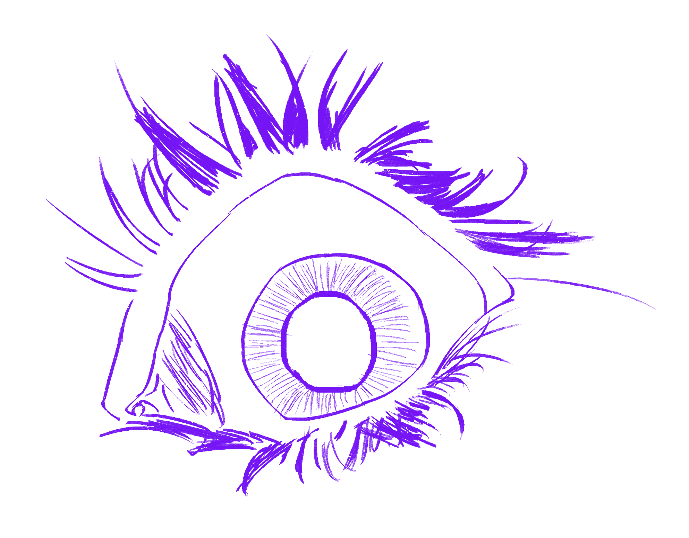

Desde que tengo conciencia, siempre he estado muy interesado por los videojuegos, lógicamente con una parte como fuente de entretenimiento pero también en gran parte en entender realmente cómo funcionan sus órganos internos, como estas experiencias interactivas generan tantas sensaciones con el componente interactivo y lo que va más allá de las líneas de código.

- Especialmente interesado en el desarrollo de **Serious Games** y el uso del medio como elemento formativo y de aprendizaje, ¡sin dejar atrás su esencia de entretenimiento!
- Amante del desarrollo de la **matemática** y fórmulas que siguen las reglas y **sistemas** de los videojuegos. 
- Gran capacidad de **trabajo en equipo** y de actuar como **cordinador** para conectar la comunicación y el estado de desarrollo entre departamentos.
- Mucha facilidad de **adaptación** y de aprendizaje, ¡Amo aprender para aprender!

En definitiva: ¡Absurdamente curioso!

## ¡Échale un ojo a mis [proyectos](/projects/)!

Aunque, si es necesario, te puedo prestar yo el ojo: 



[Gradfolio](https://github.com/jitinnair1/gradfolio){:target="_blank"} is a responsive, dark-mode ready Jekyll theme designed keeping academia in mind. The easiest way to install the theme is to fork it using GitHub. Check the README file for [instructions](https://github.com/jitinnair1/gradfolio#installation){:target="_blank"}.

If you want to use this space to write your biography here, edit the `index.md` file. You can put a picture in, too. Rename your picture to `profile.png` and put it in the `assets/images/` folder.

The social-icons footer can be used to link profiles from GitHub, OrcID and ReasearchGate apart form the usual suspects. You can add your user ID in the `_config.yml` file to link your accounts.

PS: If you liked the theme, do star it on GitHub!

### Also, check out:

- [autoCV](https://github.com/jitinnair1/autocv) - a LaTeX template that builds and deploys the CV using GitHub Actions, so you will always have a ready link for your latest CV
- [Tail](https://github.com/jitinnair1/tail) - a minimal, quick-setup template for a blog

